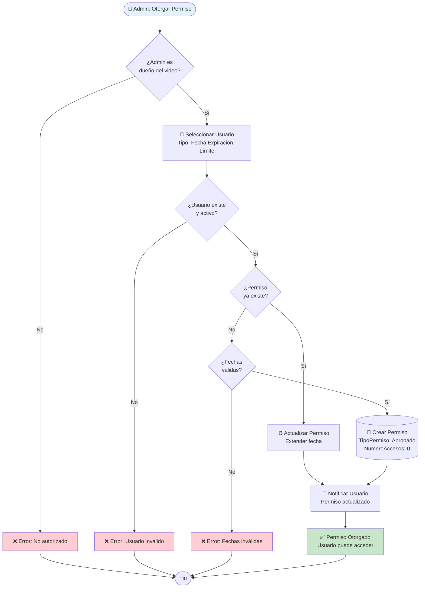
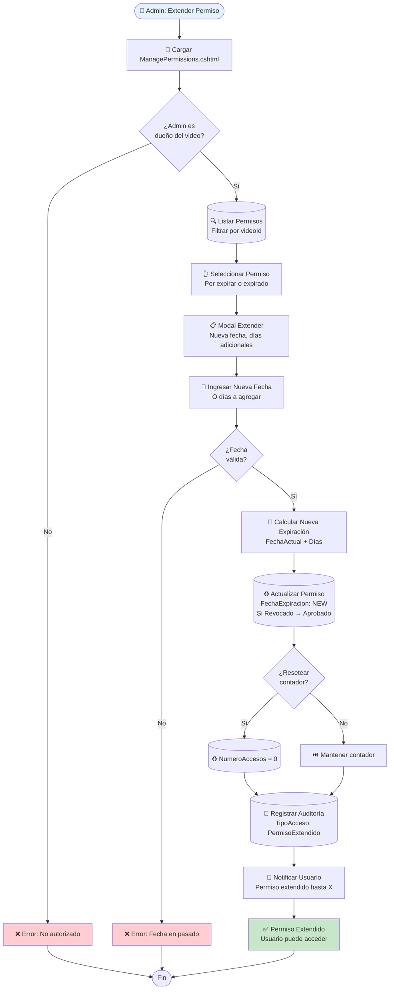
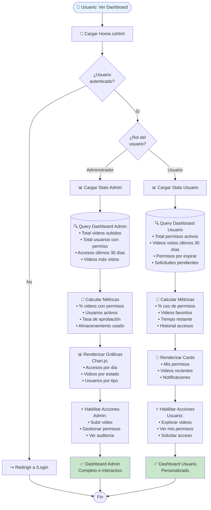
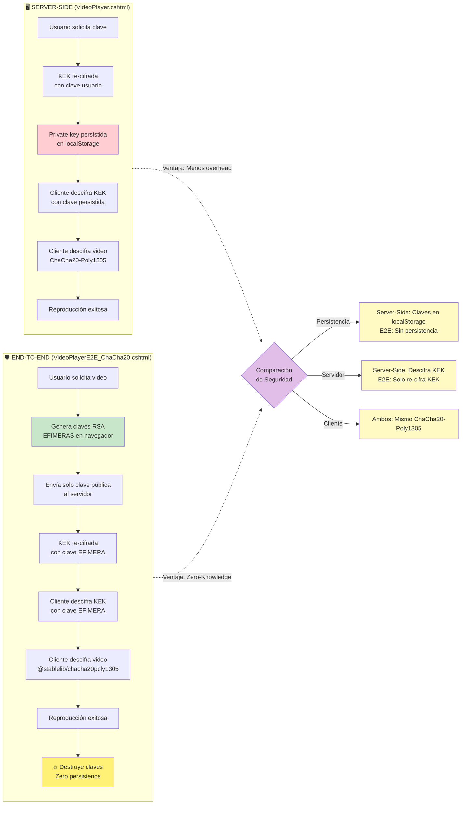

# 🔄 Flujos de Datos Principales - Código Mermaid para Draw.io

**Fecha:** 8 de diciembre de 2025  
**Versión:** 1.0 - Actualizado con E2E ChaCha20  
**Estado:** ✅ Listo para Draw.io

---

## 📖 Instrucciones para Draw.io

1. Copia cada bloque de código Mermaid (desde `graph` hasta el último `end`)
2. Abre Draw.io (https://app.diagrams.net/)
3. Ve a **Organizar → Insertar → Avanzado → Mermaid**
4. Pega el código y haz clic en **Insert**
5. Ajusta el tamaño y estilo según necesites

---

## 🔐 FLUJO 1: Registro de Usuario (Sign Up)

```mermaid
graph TD
    Start([👤 Usuario Nuevo]) --> Form[Formulario Registro<br/>Email, Contraseña, Nombre]
    Form --> GenRSA[🔑 Generar Par RSA-4096<br/>Web Crypto API]
    GenRSA --> ExportPub[📤 Exportar Clave Pública<br/>Formato PEM]
    ExportPub --> SendData[📨 POST /api/auth/register<br/>{email, password, publicKey}]
    
    SendData --> ValidateEmail{¿Email único?}
    ValidateEmail -->|No| Error1[❌ Error: Email existe]
    ValidateEmail -->|Sí| GenSalt[🧂 Generar Salt<br/>128 bits aleatorios]
    
    GenSalt --> PBKDF2[🔐 PBKDF2-SHA256<br/>100,000 iteraciones]
    PBKDF2 --> ValidateRSA{¿Clave RSA válida?}
    ValidateRSA -->|No| Error2[❌ Error: Clave inválida]
    ValidateRSA -->|Sí| GenHMAC[🔏 Generar Clave HMAC<br/>64 bytes aleatorios]
    
    GenHMAC --> SaveUser[(💾 Guardar Usuario<br/>Tabla: Usuarios)]
    SaveUser --> SaveHMAC[(💾 Guardar HMAC<br/>Tabla: ClavesUsuarios)]
    SaveHMAC --> GenJWT[🎫 Generar JWT Token<br/>exp: 24 horas]
    GenJWT --> Success[✅ Registro Exitoso<br/>Usuario autenticado]
    
    Error1 --> End([Fin])
    Error2 --> End
    Success --> End
    
    style Start fill:#e3f2fd
    style Success fill:#c8e6c9
    style Error1 fill:#ffcdd2
    style Error2 fill:#ffcdd2
    style GenRSA fill:#fff9c4
    style PBKDF2 fill:#fff9c4
    style GenHMAC fill:#fff9c4
```

---

## 🔓 FLUJO 2: Autenticación (Login)

```mermaid
graph TD
    Start([👤 Usuario Existente]) --> Form[Formulario Login<br/>Email, Contraseña]
    Form --> SendLogin[📨 POST /api/auth/login<br/>{email, password}]
    
    SendLogin --> FindUser{¿Usuario existe?}
    FindUser -->|No| Error1[❌ Error: Usuario no encontrado]
    FindUser -->|Sí| CheckActive{¿Usuario activo?}
    
    CheckActive -->|No| Error2[❌ Error: Usuario desactivado]
    CheckActive -->|Sí| GetSalt[(🔍 Obtener Salt<br/>Base de datos)]
    
    GetSalt --> CalcHash[🔐 Calcular PBKDF2<br/>password + salt]
    CalcHash --> VerifyHash{¿Hash correcto?}
    
    VerifyHash -->|No| Error3[❌ Error: Contraseña incorrecta]
    VerifyHash -->|Sí| UpdateAccess[(📝 Actualizar UltimoAcceso<br/>Timestamp actual)]
    
    UpdateAccess --> GenJWT[🎫 Generar JWT Token<br/>Incluye: userId, role, exp]
    GenJWT --> SetSession[🍪 Establecer Sesión<br/>Cookie HTTP-only]
    SetSession --> Success[✅ Login Exitoso<br/>Redirigir a /Home]
    
    Error1 --> End([Fin])
    Error2 --> End
    Error3 --> End
    Success --> End
    
    style Start fill:#e3f2fd
    style Success fill:#c8e6c9
    style Error1 fill:#ffcdd2
    style Error2 fill:#ffcdd2
    style Error3 fill:#ffcdd2
    style CalcHash fill:#fff9c4
```

---

## 📤 FLUJO 3: Subida y Cifrado de Video (Upload)

```mermaid
graph TD
    Start([🎬 Admin: Subir Video]) --> CheckAuth{¿Autenticado<br/>como Admin?}
    CheckAuth -->|No| Error1[❌ Error: No autorizado]
    CheckAuth -->|Sí| Form[📝 Formulario Upload<br/>Archivo, Título, Descripción]
    
    Form --> ValidateFile{¿Archivo válido?<br/>Tamaño, formato}
    ValidateFile -->|No| Error2[❌ Error: Archivo inválido]
    ValidateFile -->|Sí| SaveTemp[(💾 Guardar temporal<br/>wwwroot/temp/)]
    
    SaveTemp --> CalcSHA[🧮 Calcular SHA-256<br/>Video original]
    CalcSHA --> GenKEK[🔑 Generar KEK<br/>32 bytes aleatorios]
    GenKEK --> GenNonce[🎲 Generar Nonce<br/>12 bytes aleatorios]
    
    GenNonce --> EncryptVideo[🔐 Cifrar Video<br/>ChaCha20-Poly1305<br/>Chunks de 80KB]
    EncryptVideo --> GetAuthTag[🏷️ Obtener AuthTag<br/>Poly1305: 16 bytes]
    
    GetAuthTag --> GetServerKey[(🔍 Obtener Clave Servidor<br/>Storage/Keys/server_public_key.pem)]
    GetServerKey --> EncryptKEK[🔒 Cifrar KEK<br/>RSA-4096-OAEP-SHA256]
    
    EncryptKEK --> CalcHMAC[🔏 Calcular HMAC<br/>Video cifrado + HMAC Key]
    CalcHMAC --> SaveEncrypted[(💾 Guardar Video Cifrado<br/>Storage/Videos/{guid}.encrypted)]
    
    SaveEncrypted --> SaveMetadata[(💾 Guardar Metadata<br/>Tabla: Videos)]
    SaveMetadata --> SaveCrypto[(💾 Guardar CryptoData<br/>KEKCifrada, Nonce, AuthTag<br/>SHA256, HMAC)]
    
    SaveCrypto --> DeleteTemp[🗑️ Eliminar archivo temporal]
    DeleteTemp --> Success[✅ Video Subido<br/>Estado: Disponible]
    
    Error1 --> End([Fin])
    Error2 --> End
    Success --> End
    
    style Start fill:#e3f2fd
    style Success fill:#c8e6c9
    style Error1 fill:#ffcdd2
    style Error2 fill:#ffcdd2
    style EncryptVideo fill:#fff9c4
    style EncryptKEK fill:#fff9c4
    style CalcHMAC fill:#fff9c4
```

---

## 🎫 FLUJO 4: Otorgar Permiso (Grant Permission)



---

## 🔑 FLUJO 5: Distribución de Claves (Key Distribution - Server-Side)

```mermaid
graph TD
    Start([👤 Usuario: Solicitar Video]) --> CheckAuth{¿Usuario<br/>autenticado?}
    CheckAuth -->|No| Error1[❌ Error: No autenticado]
    CheckAuth -->|Sí| CheckPermission{¿Tiene permiso<br/>activo?}
    
    CheckPermission -->|No| Error2[❌ Error: Sin permiso]
    CheckPermission -->|Sí| CheckExpired{¿Permiso<br/>expirado?}
    
    CheckExpired -->|Sí| Error3[❌ Error: Permiso expirado]
    CheckExpired -->|No| CheckLimit{¿Límite accesos<br/>alcanzado?}
    
    CheckLimit -->|Sí| Error4[❌ Error: Límite alcanzado]
    CheckLimit -->|No| IsOwner{¿Es admin<br/>owner?}
    
    IsOwner -->|Sí| SkipReencrypt[⏭️ Omitir re-cifrado<br/>Admin siempre puede acceder]
    IsOwner -->|No| GetCrypto[(🔍 Obtener CryptoData<br/>KEKCifrada, Nonce, AuthTag)]
    
    GetCrypto --> GetServerKey[(🔍 Obtener Clave Servidor<br/>server_private_key.pem)]
    GetServerKey --> DecryptKEK[🔓 Descifrar KEK<br/>RSA-OAEP con clave servidor]
    
    DecryptKEK --> GetUserKey[(🔍 Obtener Clave Usuario<br/>ClavePublicaRSA)]
    GetUserKey --> ReencryptKEK[🔒 Re-cifrar KEK<br/>RSA-OAEP con clave usuario]
    
    ReencryptKEK --> GenToken[🎫 Generar Streaming Token<br/>JWT temporal: exp 5 min]
    SkipReencrypt --> GenToken
    
    GenToken --> IncrementCounter[(📈 Incrementar NumeroAccesos<br/>Actualizar UltimoAcceso)]
    IncrementCounter --> LogAccess[(📝 Registrar Acceso<br/>TipoAcceso: KeyRequest)]
    
    LogAccess --> ReturnPackage[📦 Retornar Key Package<br/>{encryptedKEK, nonce, authTag, token}]
    ReturnPackage --> Success[✅ Clave Distribuida<br/>Cliente puede descifrar]
    
    Error1 --> End([Fin])
    Error2 --> End
    Error3 --> End
    Error4 --> End
    Success --> End
    
    style Start fill:#e3f2fd
    style Success fill:#c8e6c9
    style Error1 fill:#ffcdd2
    style Error2 fill:#ffcdd2
    style Error3 fill:#ffcdd2
    style Error4 fill:#ffcdd2
    style DecryptKEK fill:#fff9c4
    style ReencryptKEK fill:#fff9c4
```

---

## 🎥 FLUJO 6: Reproducción Server-Side (VideoPlayer.cshtml)

```mermaid
graph TD
    Start([👤 Usuario: Reproducir Video]) --> LoadPage[📄 Cargar VideoPlayer.cshtml<br/>?id={videoId}]
    LoadPage --> RequestKey[🔑 POST /api/key-distribution/get-key<br/>{videoId}]
    
    RequestKey --> ReceivePackage[📦 Recibir Key Package<br/>{encryptedKEK, nonce, authTag}]
    ReceivePackage --> StorageCheck{¿Private Key<br/>en localStorage?}
    
    StorageCheck -->|No| Error1[❌ Error: No hay clave privada<br/>Usuario debe re-login]
    StorageCheck -->|Sí| GetPrivateKey[🔍 Obtener Private Key<br/>localStorage.getItem]
    
    GetPrivateKey --> ImportKey[🔧 Importar RSA Private Key<br/>Web Crypto API]
    ImportKey --> DecryptKEK[🔓 Descifrar KEK<br/>RSA-OAEP-SHA256]
    
    DecryptKEK --> RequestStream[🎬 GET /api/streaming/video/{id}<br/>Header: X-Streaming-Token]
    RequestStream --> ReceiveEncrypted[📥 Recibir Video Cifrado<br/>ChaCha20-Poly1305]
    
    ReceiveEncrypted --> DecryptVideo[🔐 Descifrar Video<br/>ChaCha20-Poly1305<br/>KEK + Nonce + AuthTag]
    DecryptVideo --> VerifyTag{¿AuthTag<br/>válido?}
    
    VerifyTag -->|No| Error2[❌ Error: Video corrupto<br/>Tag no coincide]
    VerifyTag -->|Sí| CreateBlob[📦 Crear Blob URL<br/>video/mp4]
    
    CreateBlob --> SetSource[🎥 Asignar a <video><br/>videoElement.src = blobUrl]
    SetSource --> Play[▶️ Reproducir Video<br/>Controles HTML5]
    Play --> Success[✅ Reproducción Exitosa]
    
    Error1 --> End([Fin])
    Error2 --> End
    Success --> End
    
    style Start fill:#e3f2fd
    style Success fill:#c8e6c9
    style Error1 fill:#ffcdd2
    style Error2 fill:#ffcdd2
    style DecryptKEK fill:#fff9c4
    style DecryptVideo fill:#fff9c4
```

---

## 🛡️ FLUJO 7: Reproducción End-to-End (VideoPlayerE2E_ChaCha20.cshtml)

```mermaid
graph TD
    Start([👤 Usuario: E2E Playback]) --> LoadPage[📄 Cargar VideoPlayerE2E_ChaCha20.cshtml<br/>?id={videoId}]
    LoadPage --> CheckAuth{¿Usuario<br/>autenticado?}
    
    CheckAuth -->|No| Error1[❌ Error: No autenticado]
    CheckAuth -->|Sí| GenEphemeral[🔑 Generar Claves RSA Efímeras<br/>RSA-OAEP-2048<br/>Web Crypto API]
    
    GenEphemeral --> ExportPubKey[📤 Exportar Public Key<br/>Formato SPKI Base64]
    ExportPubKey --> RequestE2E[📨 POST /api/videos/{id}/stream-e2e<br/>{clientPublicKey}]
    
    RequestE2E --> ServerValidate{Servidor:<br/>¿Tiene permiso?}
    ServerValidate -->|No| Error2[❌ Error: Sin permiso]
    ServerValidate -->|Sí| ServerReadVideo[(🔍 Servidor: Leer Video<br/>Storage/Videos/{guid}.encrypted)]
    
    ServerReadVideo --> ServerGetCrypto[(🔍 Servidor: Obtener CryptoData<br/>KEKCifrada, Nonce, AuthTag)]
    ServerGetCrypto --> ServerDecryptKEK[🔓 Servidor: Descifrar KEK<br/>Con clave privada servidor]
    
    ServerDecryptKEK --> ServerReencrypt[🔒 Servidor: Re-cifrar KEK<br/>Con clave pública EFÍMERA cliente]
    ServerReencrypt --> ServerResponse[📦 Servidor: Enviar JSON<br/>{encryptedVideo, encryptedKEK,<br/>nonce, authTag, size, format}]
    
    ServerResponse --> ClientReceive[📥 Cliente: Recibir Datos]
    ClientReceive --> ClientDecryptKEK[🔓 Cliente: Descifrar KEK<br/>Con clave privada EFÍMERA]
    
    ClientDecryptKEK --> ImportStablelib[📚 Cargar @stablelib/chacha20poly1305<br/>CDN: Skypack]
    ImportStablelib --> ClientDecryptVideo[🔐 Cliente: Descifrar Video<br/>ChaCha20-Poly1305<br/>KEK + Nonce + AuthTag]
    
    ClientDecryptVideo --> ClientVerifyTag{¿AuthTag<br/>válido?}
    ClientVerifyTag -->|No| Error3[❌ Error: Video corrupto]
    ClientVerifyTag -->|Sí| CreateBlob[📦 Crear Blob URL<br/>video/mp4]
    
    CreateBlob --> SetSource[🎥 Asignar a <video><br/>videoElement.src = blobUrl]
    SetSource --> DestroyKeys[🔥 Destruir Claves Efímeras<br/>No persiste nada]
    DestroyKeys --> Play[▶️ Reproducir Video<br/>Zero-Knowledge Mode]
    Play --> Success[✅ E2E Exitoso<br/>Servidor nunca vio plaintext]
    
    Error1 --> End([Fin])
    Error2 --> End
    Error3 --> End
    Success --> End
    
    style Start fill:#e3f2fd
    style Success fill:#c8e6c9
    style Error1 fill:#ffcdd2
    style Error2 fill:#ffcdd2
    style Error3 fill:#ffcdd2
    style GenEphemeral fill:#fff9c4
    style ServerDecryptKEK fill:#ffebee
    style ServerReencrypt fill:#ffebee
    style ClientDecryptKEK fill:#e8f5e9
    style ClientDecryptVideo fill:#e8f5e9
    style DestroyKeys fill:#fff176
```

---

## ✅ FLUJO 8: Verificación de Integridad

```mermaid
graph TD
    Start([👤 Usuario: Verificar Video]) --> LoadPage[📄 Cargar IntegrityCheck.cshtml<br/>?id={videoId}]
    LoadPage --> CheckAccess{¿Tiene permiso<br/>o es owner?}
    
    CheckAccess -->|No| Error1[❌ Error: Sin acceso]
    CheckAccess -->|Sí| GetVideo[(🔍 Obtener Video<br/>Tabla: Videos)]
    
    GetVideo --> GetCrypto[(🔍 Obtener CryptoData<br/>SHA256, HMAC, AuthTag)]
    GetCrypto --> ReadEncrypted[(📖 Leer Video Cifrado<br/>Storage/Videos/{guid}.encrypted)]
    
    ReadEncrypted --> CalcHMACNow[🧮 Calcular HMAC Actual<br/>Video cifrado + HMAC Key]
    CalcHMACNow --> CompareHMAC{¿HMAC<br/>coincide?}
    
    CompareHMAC -->|No| Fail1[❌ HMAC Inválido<br/>Video modificado]
    CompareHMAC -->|Sí| CheckAuthTag{¿AuthTag<br/>en CryptoData?}
    
    CheckAuthTag -->|No| Skip[⏭️ Omitir verificación<br/>AuthTag legacy]
    CheckAuthTag -->|Sí| VerifyPoly1305{¿Poly1305<br/>AuthTag válido?}
    
    VerifyPoly1305 -->|No| Fail2[❌ AuthTag Inválido<br/>Cifrado corrupto]
    VerifyPoly1305 -->|Sí| DecryptVideo[🔓 Descifrar Video<br/>Para validar SHA-256]
    
    Skip --> DecryptVideo
    DecryptVideo --> CalcSHA[🧮 Calcular SHA-256<br/>Video descifrado]
    CalcSHA --> CompareSHA{¿SHA-256<br/>coincide?}
    
    CompareSHA -->|No| Fail3[❌ SHA-256 Inválido<br/>Contenido alterado]
    CompareSHA -->|Sí| Success[✅ Video Íntegro<br/>Todas las verificaciones OK]
    
    Error1 --> End([Fin])
    Fail1 --> End
    Fail2 --> End
    Fail3 --> End
    Success --> End
    
    style Start fill:#e3f2fd
    style Success fill:#c8e6c9
    style Error1 fill:#ffcdd2
    style Fail1 fill:#ffcdd2
    style Fail2 fill:#ffcdd2
    style Fail3 fill:#ffcdd2
    style CalcHMACNow fill:#fff9c4
    style VerifyPoly1305 fill:#fff9c4
    style CalcSHA fill:#fff9c4
```

---

## 🔄 FLUJO 9: Solicitud de Acceso (Request Access)

```mermaid
graph TD
    Start([👤 Usuario: Solicitar Acceso]) --> Browse[🔍 Explorar VideoGrid.cshtml<br/>Ver videos disponibles]
    Browse --> SelectVideo[📹 Seleccionar Video<br/>Sin permiso actual]
    
    SelectVideo --> ClickRequest[👆 Click: Solicitar Acceso<br/>Modal con justificación]
    ClickRequest --> FillForm[📝 Llenar Formulario<br/>Mensaje, Tiempo necesario]
    
    FillForm --> SendRequest[📨 POST /api/permissions/request-access<br/>{videoId, justificacion}]
    SendRequest --> CreatePending[(💾 Crear Permiso<br/>TipoPermiso: Pendiente<br/>Estado: En espera)]
    
    CreatePending --> NotifyAdmin[📧 Notificar Admin<br/>Email + Dashboard]
    NotifyAdmin --> WaitApproval[⏳ Esperar Aprobación<br/>Estado visible en dashboard]
    
    WaitApproval --> AdminDecision{Admin:<br/>¿Aprobar?}
    AdminDecision -->|Rechazar| Reject[(❌ Actualizar Permiso<br/>TipoPermiso: Revocado)]
    AdminDecision -->|Aprobar| Approve[(✅ Actualizar Permiso<br/>TipoPermiso: Aprobado<br/>Establecer FechaExpiracion)]
    
    Reject --> NotifyReject[📧 Notificar Usuario<br/>Solicitud rechazada]
    Approve --> NotifyApprove[📧 Notificar Usuario<br/>Acceso concedido]
    
    NotifyReject --> EndReject[❌ Acceso Denegado]
    NotifyApprove --> EndSuccess[✅ Puede Ver Video]
    
    EndReject --> End([Fin])
    EndSuccess --> End
    
    style Start fill:#e3f2fd
    style EndSuccess fill:#c8e6c9
    style EndReject fill:#ffcdd2
```

---

## 🗑️ FLUJO 10: Revocar Permiso (Revoke Permission)

```mermaid
graph TD
    Start([👤 Admin: Revocar Permiso]) --> LoadPage[📄 Cargar ManagePermissions.cshtml<br/>?videoId={id}]
    LoadPage --> CheckOwner{¿Admin es<br/>dueño del video?}
    
    CheckOwner -->|No| Error1[❌ Error: No autorizado]
    CheckOwner -->|Sí| ListPermissions[(🔍 Listar Permisos<br/>Filtrar por videoId)]
    
    ListPermissions --> SelectUser[👆 Seleccionar Usuario<br/>Con permiso activo]
    SelectUser --> ConfirmRevoke{¿Confirmar<br/>revocación?}
    
    ConfirmRevoke -->|No| Cancel[❌ Cancelar Operación]
    ConfirmRevoke -->|Sí| UpdatePermission[(♻️ Actualizar Permiso<br/>TipoPermiso: Revocado<br/>FechaRevocacion: NOW<br/>RevocadoPor: AdminId)]
    
    UpdatePermission --> InvalidateToken[🚫 Invalidar Tokens<br/>Tokens activos expirados]
    InvalidateToken --> LogRevoke[(📝 Registrar Auditoría<br/>TipoAcceso: PermisoRevocado)]
    
    LogRevoke --> NotifyUser[📧 Notificar Usuario<br/>Permiso revocado]
    NotifyUser --> CheckActive{¿Usuario está<br/>viendo ahora?}
    
    CheckActive -->|Sí| KillSession[🔴 Terminar Sesión<br/>Streaming interrumpido]
    CheckActive -->|No| SkipKill[⏭️ Sin acción<br/>No hay sesión activa]
    
    KillSession --> Success[✅ Permiso Revocado<br/>Acceso bloqueado]
    SkipKill --> Success
    
    Error1 --> End([Fin])
    Cancel --> End
    Success --> End
    
    style Start fill:#e3f2fd
    style Success fill:#c8e6c9
    style Error1 fill:#ffcdd2
    style Cancel fill:#ffecb3
```

---

## 📊 FLUJO 11: VideoGrid - Exploración de Catálogo

```mermaid
graph TD
    Start([👤 Usuario: Explorar Videos]) --> LoadPage[📄 Cargar VideoGrid.cshtml]
    LoadPage --> CheckAuth{¿Usuario<br/>autenticado?}
    
    CheckAuth -->|No| ShowPublic[👁️ Mostrar Solo Públicos<br/>Sin información de permisos]
    CheckAuth -->|Sí| GetUserId[🔍 Obtener UserId<br/>De sesión/JWT]
    
    ShowPublic --> RenderGrid[📺 Renderizar Grid<br/>Modo solo lectura]
    GetUserId --> QueryDB[(🔍 Query: Videos con Permisos<br/>JOIN DatosCriptograficosVideos<br/>LEFT JOIN Permisos)]
    
    QueryDB --> FilterByUser{¿Filtrar por<br/>Admin?}
    FilterByUser -->|Sí| FilterAdmin[🔎 WHERE IdAdministrador = UserId]
    FilterByUser -->|No| AllVideos[🔎 Obtener Todos]
    
    FilterAdmin --> ApplySearch{¿Hay término<br/>búsqueda?}
    AllVideos --> ApplySearch
    
    ApplySearch -->|Sí| SearchFilter[🔍 LIKE %search%<br/>En Titulo, Descripcion]
    ApplySearch -->|No| SkipSearch[⏭️ Sin filtro]
    
    SearchFilter --> OrderResults[📊 ORDER BY FechaSubida DESC]
    SkipSearch --> OrderResults
    
    OrderResults --> EnrichPermissions[🔐 Enriquecer con Permisos<br/>Para cada video:<br/>¿TienePermiso?<br/>Estado, FechaExpiracion]
    
    EnrichPermissions --> RenderGrid
    RenderGrid --> ShowBadges[🏷️ Mostrar Badges<br/>✅ Con Acceso<br/>⏳ Pendiente<br/>🔒 Sin Permiso<br/>👑 Propietario]
    
    ShowBadges --> EnableActions[⚡ Habilitar Acciones<br/>• Ver (si tiene permiso)<br/>• Solicitar (si no tiene)<br/>• Gestionar (si es owner)]
    
    EnableActions --> Success[✅ Grid Renderizado<br/>Interactivo]
    
    Success --> End([Fin])
    
    style Start fill:#e3f2fd
    style Success fill:#c8e6c9
```

---

## 🔄 FLUJO 12: Extender Permiso (Extend Permission)



---

## 🔍 FLUJO 13: Auditoría de Accesos (Access Logs)

```mermaid
graph TD
    Start([👤 Admin: Ver Auditoría]) --> CheckRole{¿Usuario es<br/>Administrador?}
    CheckRole -->|No| Error1[❌ Error: Solo admins]
    CheckRole -->|Sí| SelectView{¿Qué ver?}
    
    SelectView -->|Mis Videos| QueryMyVideos[(🔍 Query: RegistroAccesos<br/>JOIN Videos<br/>WHERE IdAdministrador = UserId)]
    SelectView -->|Video Específico| QueryOneVideo[(🔍 Query: RegistroAccesos<br/>WHERE IdVideo = X)]
    SelectView -->|Todos| QueryAll[(🔍 Query: RegistroAccesos<br/>Sin filtros)]
    
    QueryMyVideos --> ApplyFilters{¿Aplicar<br/>filtros?}
    QueryOneVideo --> ApplyFilters
    QueryAll --> ApplyFilters
    
    ApplyFilters -->|Rango Fechas| FilterDates[📅 WHERE FechaAcceso<br/>BETWEEN start AND end]
    ApplyFilters -->|Tipo Acceso| FilterType[🔖 WHERE TipoAcceso<br/>IN (tipos)]
    ApplyFilters -->|Usuario| FilterUser[👤 WHERE IdUsuario = X]
    ApplyFilters -->|Exitoso/Fallido| FilterSuccess[✅❌ WHERE Exitoso = bool]
    ApplyFilters -->|Sin filtros| SkipFilters[⏭️ Consulta base]
    
    FilterDates --> OrderResults[📊 ORDER BY FechaAcceso DESC]
    FilterType --> OrderResults
    FilterUser --> OrderResults
    FilterSuccess --> OrderResults
    SkipFilters --> OrderResults
    
    OrderResults --> Paginate[📄 LIMIT, OFFSET<br/>Paginación]
    Paginate --> EnrichData[🔐 Enriquecer Datos<br/>Nombres usuario, video<br/>IP, UserAgent]
    
    EnrichData --> CalcStats[📈 Calcular Estadísticas<br/>Total accesos, exitosos,<br/>fallidos, usuarios únicos]
    
    CalcStats --> RenderTable[📊 Renderizar Tabla<br/>Fecha, Usuario, Video,<br/>Tipo, Resultado, IP]
    
    RenderTable --> EnableExport[💾 Habilitar Exportar<br/>CSV, Excel, PDF]
    EnableExport --> Success[✅ Auditoría Visible<br/>Filtrable y exportable]
    
    Error1 --> End([Fin])
    Success --> End
    
    style Start fill:#e3f2fd
    style Success fill:#c8e6c9
    style Error1 fill:#ffcdd2
```

---

## 📈 FLUJO 14: Dashboard de Estadísticas (Home.cshtml)



---

## 🔐 COMPARACIÓN: Server-Side vs End-to-End



---

## 📊 Resumen de Flujos

| # | Flujo | Actores | Operaciones Cripto | Resultado |
|---|-------|---------|-------------------|-----------|
| 1 | **Registro** | Usuario → Servidor | RSA-4096, PBKDF2, HMAC | Usuario registrado |
| 2 | **Login** | Usuario → Servidor | PBKDF2, JWT | Sesión autenticada |
| 3 | **Upload** | Admin → Servidor | ChaCha20, RSA, SHA-256, HMAC | Video cifrado |
| 4 | **Grant Permission** | Admin → Servidor | N/A | Permiso otorgado |
| 5 | **Key Distribution** | Usuario → Servidor | RSA re-encryption | KEK distribuida |
| 6 | **Server-Side Play** | Usuario → Cliente | RSA decrypt, ChaCha20 | Video reproducido |
| 7 | **E2E Play** | Usuario → Cliente | RSA ephemeral, ChaCha20 | E2E playback |
| 8 | **Integrity Check** | Usuario/Admin → Servidor | SHA-256, HMAC, Poly1305 | Integridad validada |
| 9 | **Request Access** | Usuario → Admin | N/A | Solicitud creada |
| 10 | **Revoke Permission** | Admin → Servidor | N/A | Acceso bloqueado |
| 11 | **VideoGrid** | Usuario → Servidor | N/A | Catálogo renderizado |
| 12 | **Extend Permission** | Admin → Servidor | N/A | Fecha extendida |
| 13 | **Audit Logs** | Admin → Servidor | N/A | Auditoría visible |
| 14 | **Dashboard** | Usuario/Admin → Servidor | N/A | Estadísticas |

---

## 🎨 Paleta de Colores para Draw.io

Para mantener consistencia visual en Draw.io, usa estos colores:

- **Inicio/Usuario**: `#e3f2fd` (Azul claro)
- **Éxito**: `#c8e6c9` (Verde claro)
- **Error**: `#ffcdd2` (Rojo claro)
- **Operación Cripto**: `#fff9c4` (Amarillo claro)
- **Servidor**: `#ffebee` (Rosa claro)
- **Cliente**: `#e8f5e9` (Verde menta)
- **Advertencia**: `#fff176` (Amarillo brillante)
- **Decisión**: `#e1bee7` (Púrpura claro)

---

## 📝 Notas Importantes

### Diferencias Clave E2E vs Server-Side

1. **Claves RSA**:
   - **Server-Side**: Usa claves persistidas en localStorage (vulnerables si dispositivo comprometido)
   - **E2E**: Genera claves efímeras por sesión (destruidas al finalizar)

2. **Descifrado KEK**:
   - **Server-Side**: Servidor descifra KEK con su clave privada
   - **E2E**: Servidor NUNCA descifra, solo re-cifra con clave efímera del cliente

3. **Librería ChaCha20**:
   - **Server-Side**: Puede usar Web Crypto API (si soporta ChaCha20)
   - **E2E**: Usa `@stablelib/chacha20poly1305` desde CDN (Skypack)

4. **Zero-Knowledge**:
   - **Server-Side**: Servidor puede acceder al video descifrado
   - **E2E**: Servidor NUNCA ve el video descifrado

### Casos de Uso Recomendados

- **Server-Side**: Para videos corporativos, contenido educativo, streaming de alta demanda
- **E2E**: Para contenido sensible, médico, legal, financiero, documentos confidenciales

---

## ✅ Checklist de Validación

Antes de implementar en producción, verifica:

- [ ] Todos los flujos generan logs de auditoría
- [ ] Permisos expirados se validan en cada acceso
- [ ] Límites de accesos se respetan
- [ ] AuthTags de Poly1305 se verifican
- [ ] Claves efímeras se destruyen después de E2E
- [ ] Tokens JWT expiran correctamente (5 min streaming, 24h sesión)
- [ ] SHA-256 e HMAC se validan en verificación de integridad
- [ ] Notificaciones por email funcionan (grant, revoke, extend)
- [ ] Contadores de accesos se incrementan correctamente
- [ ] VideoGrid muestra badges correctos según permisos

---

## 🚀 Próximos Pasos

1. **Importar diagramas a Draw.io**
2. **Ajustar estilos y colores según preferencia**
3. **Agregar iconos adicionales si es necesario**
4. **Exportar en formato PNG/SVG para documentación**
5. **Incluir en presentación final del proyecto**

---

**Fecha de Creación:** 8 de diciembre de 2025  
**Autor:** GitHub Copilot  
**Versión:** 1.0  
**Estado:** ✅ Listo para Draw.io
